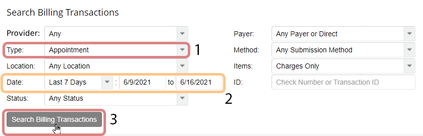
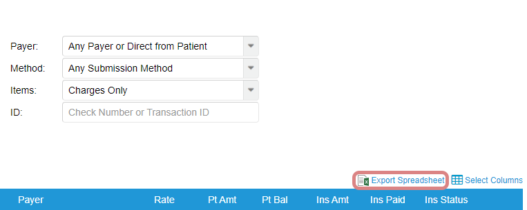
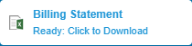

# Billing Transactions file

## Get this file

### Step 1

[TherapyNotes](https://www.therapynotes.com) &dash;&gt; [Billing](https://www.therapynotes.com/app/billing/). Under "Search Billing Transactions", change Type to "Appointment", change the date range as needed, and then click Search Billing Transactions button:

### Step 2

Click on "Export Spreadsheet":

### Step 3

Click on the file at the bottom once it's ready:

