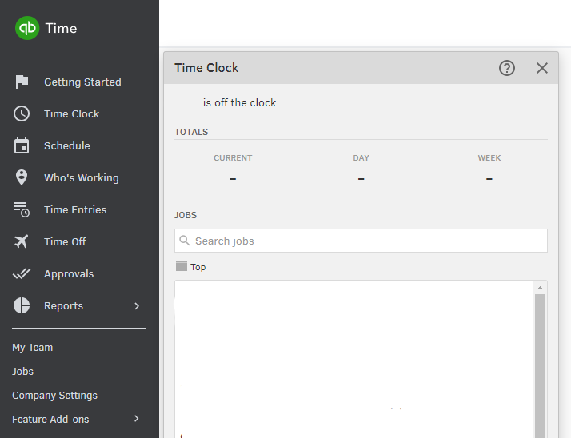

# Timesheet Report file

Go to TSheets &gt; Reports &gt; Payroll:

You can leave the options as-is. Adjust the Pay Period as needed and click Run Report:

Once the report loads, click Download and then **Individual Timesheets (CSV)** on the right side:

