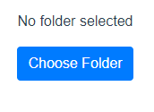

# Getting Started with Reports

This app,

## Introduction

Dashboard doesn't make a copy of files that you use to make reports. This is to limit how many places this sensitive information is stored, as well, as to keep

