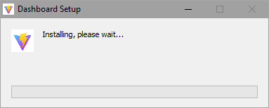

## How to Install Dashboard

### Step 1

Go to [this](https://github.com/parsehex/dashboard2/releases/latest) page. Click on the first link that ends in "exe" to download Dashboard:

### Step 2

Open the file once it's done downloading.

If a window like the one below comes up, click "More info" (1) and then "Run Anyway" (2):

**Only do this when installing Dashboard, unless you know what you're doing!**

### Step 3

Dashboard will start installing and open when it's done.
