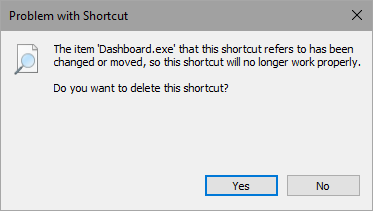

# Updating Dashboard

Dashboard will keep itself updated automatically. It checks for an update when it starts up, and you can check manually by going to `Help` &dash;&gt; `Check for update`. If there is an update available to install then you should see a Windows notification come up. The update will be installled once you close Dashboard.

**Note**: You should wait for up to a minute after closing Dashboard before trying to open it again. If you try to open it and get a window like the below, click **No**. Wait another minute or so and try opening it again.

